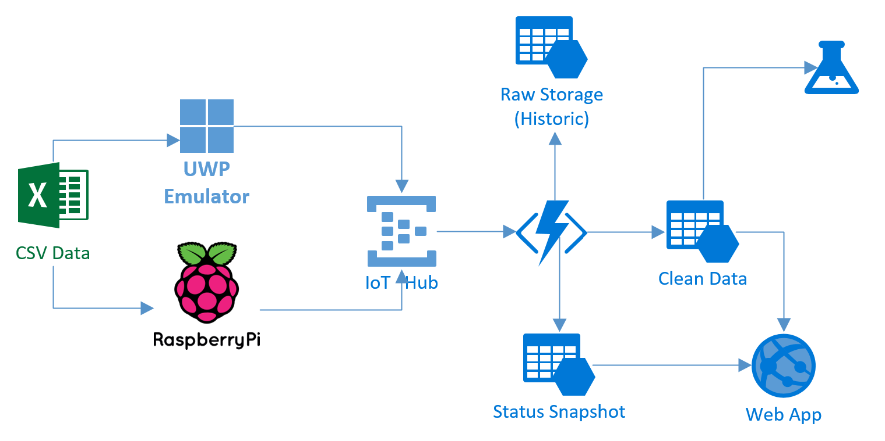
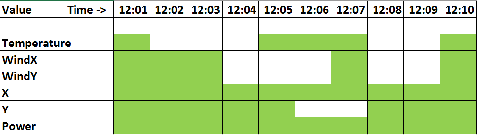

# IoTNanoSuite

**IoT NanoSuite** is designed as a sample IoT system that demonstrates the usage of Microsoft Azure for light-weight real-time ingestion and processing of messages from a number of sensors. It uses **Azure Functions** for doing real-time data processing, which is very cost-efficient way, yet it offers quite a lot of flexibility for message processing and automatic scaling (serverless compute). 

Here is the architecture overview of the solution:

## Technologies used

The following technologies are used in the NanoSuite:
 * Device Emulator in the form of UWP application, capable of running on Raspberry Pi 2/3. The emulator can send pre-recorded data from CSV table, or generate some random data
 * Azure IoT Hub or Event Hub for data ingestion. We have used IoT Hub, because it gives the most flexibility in sending feedback to the devices.
 * Azure Functions for data processing
 * Azure Storage for storing the original raw data, processed data, as well we current status snapshot for all devices.

## What is included

The package consists of the following projects:
* [AzureFunction](AzureFunction) - the code of the Azure Function that is deployed to the cloud to do realtime message processing and interpolation for missing values
* [IoTNanoSuite/DeviceEmulator](IoTNanoSuite/DeviceEmulator) - Device Emulator that can be used to send sample messages to the IoT Hub. The emulator is UWP application, and can be deployed on any Windows Device, including **Raspberry Pi** running Windows IoT Suite.
* [IoTNanoSuite/WebPortal](IoTNanoSuite/WebPortal) - simple web application that displays the data in graphical form.

## How to deploy

To create the working solution, you would need:
* Create IoT Hub (or Event Hub) in the Azure Portal. In the sample it is named `NanoHub`
* Create Azure Storage account called `nanostoredb`
* Create an Azure Function and manually connect it to the IoT Hub (using the correct endpoint for the Event Hub)
* Put correct connection string for IoT Hub into `Config.cs` file of the [Emulator Project](IoTNanoSuite/DeviceEmulator)
* Put correct Azure Storage connection string into `Config.cs` of [NanoDB project](IoTNanoSuite/NanoDB)
* Open device emulator, start it, open web portal and enjoy changing data!

## Azure Function and Data Processing

Azure function was implemented in C#. It performs the following tasks:
 * Collecting data from Event Hub/IoT Hub into Raw Azure Tables storage
 * Mainatining status snapshot of all connected devices, i.e. a table that would contain latest readings for all devices as well as their status.
 * Filling in missing values by using interpolation, and providing output stream of the clean readings. This output stream in our case was Azure Storage Table, but it could also be Azure Queue/Event Hub, in case we want to create microservices architecture

The latter task turns our to be the most problematic, since to do the interpolation we need to have all the data readings from the point preceding the missing value up to the next available reading. Also, it could happen that several values are missing.

To do the interpolation, we have developed [`Interpolator`](https://github.com/evangelism/IoTNanoSuite/blob/master/AzureFunction/QueueTriggerCSharp1/Interpolator.csx) class. The algorithm works as follows:
 * All readings without missing values are passed through to the output storage immediately.
 * When missing value is encountered, previous and current readings are stored into the queue, and we switch into interpolation mode.
 * All subsequent readings with missing values are stored into the queue
 * When a reading without missing values is encountered in the interpolation mode, we get all values from the queue, call the `Interpolator` class to do the actual interpolation, and then push all the values into output store

Here is an example of data that is stored into temporary storage and then fed through the `Intepolator.cs`:

## Changing the values schema

If you need to change the values that are collected from IoT Sensors, this needs to be done in several places:
 * `SensorData.cs` class in the [Emulator Project](IoTNanoSuite/DeviceEmulator)
 * `SenrorData.cs` class in the [NanoDB Project](IoTNanoSuite/NanoDB). It is essentially the same as the class above, but it derives from `TableEntity`
 * `data.csx` file in the [Azure Function](AzureFunction), that contains data structures both for device readings and for static snapshot.
 * `Interpolator.cs` contains `gets` and `sets` arrays of functions that represent data getters and setters for all fields that need to be interpolated.
 * Data logic for calculating the status snapshot of devices needs to be changed in `run.csx` main Azure Function code
